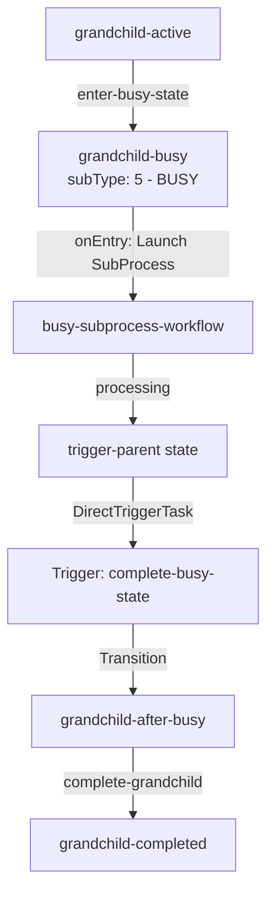

# Busy State Test Implementation

## Overview

This document describes the implementation of the Busy state test feature in the grandchild workflow. The test demonstrates the new `subType: 5` (Busy) state functionality.

## New State subType Values

- **Busy: 5** - State is busy processing, waiting for external trigger
- **Human: 6** - State is waiting for human interaction

## Test Objective

Test the Busy state behavior where:
1. A workflow enters a Busy state (`subType: 5`)
2. The state launches a subprocess that runs independently
3. The workflow waits in Busy state for the subprocess to complete
4. The subprocess triggers a transition on the parent workflow when complete
5. The parent workflow exits Busy state and continues normal flow

## Expected Behavior

```
State enters → Status: BUSY → Waits → SubProcess completes → SubProcess pings parent → Transition occurs → State changes
```

## Components Created

### 1. Tasks

#### `start-busy-subprocess-task.json`
- **Type**: 11 (SubProcessTask)
- **Purpose**: Launches the busy subprocess workflow
- **Location**: `core/Tasks/subflow-test/start-busy-subprocess-task.json`

#### `trigger-busy-completion-task.json`
- **Type**: 12 (DirectTriggerTask)
- **Purpose**: Triggers transition on parent workflow from subprocess
- **Location**: `core/Tasks/subflow-test/trigger-busy-completion-task.json`

### 2. Workflows

#### `busy-subprocess-workflow.json`
- **Purpose**: Independent subprocess that runs while parent is in Busy state
- **States**:
  - `processing` (Initial) - Subprocess starts and processes
  - `trigger-parent` (Intermediate) - Triggers parent workflow transition
  - `completed` (Final) - Subprocess completes
- **Location**: `core/Workflows/subflow-test/busy-subprocess-workflow.json`

### 3. Mappings

#### `StartBusySubprocessMapping.csx`
- **Purpose**: Configures and launches the subprocess
- **Task**: SubProcessTask (Type 11)
- **Actions**:
  - Sets subprocess domain, flow, and key
  - Passes parent instance ID to subprocess
  - Prepares subprocess initialization data

#### `BusySubprocessStartMapping.csx`
- **Purpose**: Initializes subprocess instance
- **Actions**:
  - Stores parent instance information
  - Prepares subprocess data

#### `TriggerParentBusyCompletionMapping.csx`
- **Purpose**: Triggers parent workflow transition from subprocess
- **Task**: DirectTriggerTask (Type 12)
- **Actions**:
  - Sets target instance (parent workflow)
  - Sets transition name (`complete-busy-state`)
  - Prepares transition payload with completion data

### 4. Workflow States

#### Modified `subflow-view-test-grandchild.json`

Added new states:

**State: `grandchild-busy`**
- **Type**: Intermediate (2)
- **SubType**: Busy (5) ⚠️ NEW FEATURE
- **OnEntry**: Launches subprocess via `start-busy-subprocess-task`
- **Transition**: `complete-busy-state` - Manual transition triggered by subprocess

**State: `grandchild-after-busy`**
- **Type**: Intermediate (2)
- **SubType**: Normal (0)
- **Purpose**: Continues workflow after busy state completes

## Workflow Flow



## Testing Steps

See `subflow-view-test.http` for complete test sequence. Key steps:

1. **Step 17**: Trigger `enter-busy-state` transition
2. **Step 18**: Verify state is `grandchild-busy` with `subType: 5`
3. **Step 19**: Check data shows subprocess launched
4. **Step 20**: Wait ~5-10 seconds for subprocess to complete
5. **Step 21**: Verify state automatically changed to `grandchild-after-busy`
6. **Step 22**: Check data shows subprocess completion and trigger info
7. **Step 23**: Complete grandchild workflow normally

## API Endpoints Used

### Start Busy State
```http
PATCH http://localhost:4201/api/v1/core/workflows/subflow-view-test-grandchild/instances/{instanceId}/transitions/enter-busy-state
```

### Check State (Should show BUSY status)
```http
GET http://localhost:4201/api/v1/core/workflows/subflow-view-test-grandchild/instances/{instanceId}/functions/state
```

### Get Instance Data
```http
GET http://localhost:4201/api/v1/core/workflows/subflow-view-test-grandchild/instances/{instanceId}/functions/data
```

## Task Types Reference

### SubProcessTask (Type 11)
- Fire-and-forget subprocess launch
- Subprocess runs independently
- Parent doesn't wait for subprocess completion
- Used in: `start-busy-subprocess-task`

### DirectTriggerTask (Type 12)
- Triggers specific transition on existing workflow instance
- Requires target instance ID and transition name
- Used in: `trigger-busy-completion-task`

## Expected Data Flow

### When Entering Busy State

```json
{
  "subprocessLaunched": true,
  "subprocessInstanceId": "uuid",
  "launchedAt": "timestamp",
  "status": "BUSY"
}
```

### When SubProcess Triggers Parent

```json
{
  "transitionTriggered": true,
  "triggeredAt": "timestamp",
  "parentNewState": "grandchild-after-busy",
  "status": "PARENT_TRANSITION_SUCCESS",
  "result": {
    "subprocessCompleted": true,
    "busyStateTestPassed": true
  }
}
```

## Known Issues

### Schema Validation

The `subType: 5` value currently fails schema validation because it's a new feature under development:

```
Schema validation failed for workflow:
/attributes/states/1/subType: must be equal to one of the allowed values (line 74) ({"allowedValues":[0,1,2,3,4]})
```

**Resolution**: The `@burgan-tech/vnext-schema` package needs to be updated to include:
- `Busy: 5`
- `Human: 6`

Once the schema is updated, validation will pass.

## Files Modified/Created

### Created Files
- `core/Tasks/subflow-test/start-busy-subprocess-task.json`
- `core/Tasks/subflow-test/trigger-busy-completion-task.json`
- `core/Workflows/subflow-test/busy-subprocess-workflow.json`
- `core/Workflows/subflow-test/src/StartBusySubprocessMapping.csx`
- `core/Workflows/subflow-test/src/BusySubprocessStartMapping.csx`
- `core/Workflows/subflow-test/src/TriggerParentBusyCompletionMapping.csx`

### Modified Files
- `core/Workflows/subflow-test/subflow-view-test-grandchild.json` - Added busy state and transitions
- `core/Workflows/subflow-test/subflow-view-test.http` - Added busy state test steps

## Architecture Benefits

1. **State Awareness**: Runtime knows the state is busy (subType: 5)
2. **Status Tracking**: Can monitor busy states across all workflows
3. **Independent Processing**: Subprocess runs without blocking
4. **Automatic Transition**: Subprocess triggers parent when ready
5. **Flexible Pattern**: Can be used for any long-running operation

## Use Cases

This pattern is useful for:
- Long-running background processes
- External API calls with callbacks
- Async processing workflows
- Human approval processes (with subType: 6)
- Queue-based processing

## Related Documentation

- vNext Runtime Docs: TriggerTask types (SubProcess, DirectTrigger)
- State lifecycle and subTypes
- Transition trigger types
