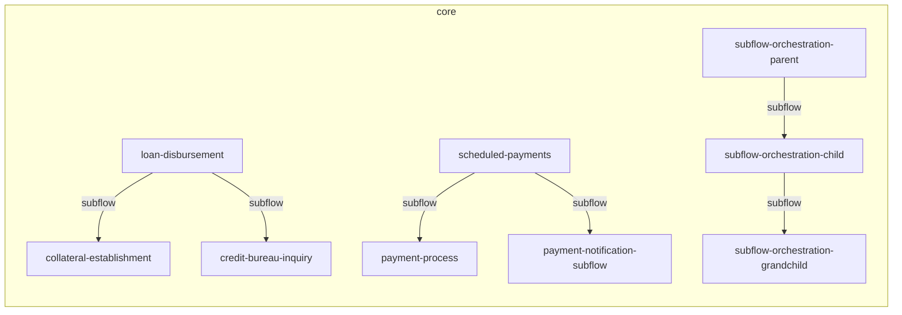

# vnext-example - Dependency Tree

This document provides a dependency analysis across all workflows in the project, including cross-domain usage and inter-flow relationships.

## Overview

| Metric | Value |
| --- | --- |
| Total Workflows | 12 |
| Total Cross-Domain References | 0 |
| External Domains | - |
| Inter-Flow Edges | 6 |

## Cross-Domain Dependencies

> **No Cross-Domain Dependencies**
>
> All workflow references are within the same domain.

## Inter-Flow Dependencies

| Source Workflow | Target Workflow | Edge Type | Cross-domain |
| --- | --- | --- | --- |
| `loan-disbursement` (core) | `credit-bureau-inquiry` (core) | subflow | - |
| `loan-disbursement` (core) | `collateral-establishment` (core) | subflow | - |
| `scheduled-payments` (core) | `payment-process` (core) | subflow | - |
| `scheduled-payments` (core) | `payment-notification-subflow` (core) | subflow | - |
| `subflow-orchestration-parent` (core) | `subflow-orchestration-child` (core) | subflow | - |
| `subflow-orchestration-child` (core) | `subflow-orchestration-grandchild` (core) | subflow | - |

## Workflow Dependency Details

| Workflow | Domain | Total Dependencies | Cross-domain Count | External Domains |
| --- | --- | --- | --- | --- |
| `account-opening` | core | 19 | 0 | - |
| `collateral-establishment` | core | 1 | 0 | - |
| `credit-bureau-inquiry` | core | 2 | 0 | - |
| `loan-disbursement` | core | 20 | 0 | - |
| `money-transfer` | core | 11 | 0 | - |
| `payment-notification-subflow` | core | 3 | 0 | - |
| `payment-process` | core | 2 | 0 | - |
| `scheduled-payments` | core | 7 | 0 | - |
| `soap-task-test` | core | 5 | 0 | - |
| `subflow-orchestration-child` | core | 4 | 0 | - |
| `subflow-orchestration-grandchild` | core | 2 | 0 | - |
| `subflow-orchestration-parent` | core | 3 | 0 | - |

---
*Generated by vNext Forge*