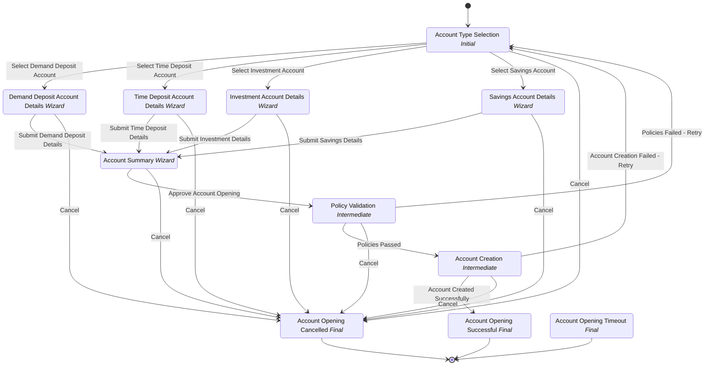

# Digital Banking Account Opening Workflow

## Metadata

| Property | Value |
| --- | --- |
| Key | `account-opening` |
| Domain | `core` |
| Flow | `sys-flows` |
| Version | 1.0.0 |
| Flow Version | 1.0.0 |
| Type | Flow |
| Tags | `banking`, `account-opening`, `demand-deposit`, `digital-banking`, `customer-onboarding` |

## State Lifecycle

## Feature Matrix

| Feature | Status |
| --- | --- |
| Cancel Transition | Yes |
| Exit Transition | Yes |
| Update Data Transition | - |
| Master Schema | - |
| Functions | Yes |
| Extensions | - |
| Timeout | Yes |
| Error Boundary | - |
| Shared Transitions | - |
| Query Roles | Yes |

## Dependency Tree

### Tasks

| Key | Domain | Version | Cross-domain | Source |
| --- | --- | --- | --- | --- |
| `script-task` | core | 1.0.0 | - | startTransition.onExecutionTasks[0] |
| `notify-state` | core | 1.0.0 | - | states[account-type-selection].onEntries[0] |
| `validate-account-policies` | core | 1.0.0 | - | states[policy-validation].onEntries[0] |
| `create-bank-account` | core | 1.0.0 | - | states[account-creation].onEntries[0] |

### Views

| Key | Domain | Version | Cross-domain | Source |
| --- | --- | --- | --- | --- |
| `account-type-selection-view` | core | 1.0.0 | - | states[account-type-selection].view |
| `demand-deposit-input-view` | core | 1.0.0 | - | states[demand-deposit-info].transitions[submit-demand-deposit-info].view |
| `time-deposit-input-view` | core | 1.0.0 | - | states[time-deposit-info].transitions[submit-time-deposit-info].view |
| `investment-account-input-view` | core | 1.0.0 | - | states[investment-account-info].transitions[submit-investment-account-info].view |
| `savings-account-input-view` | core | 1.0.0 | - | states[savings-account-info].transitions[submit-savings-account-info].view |
| `account-confirmation-view` | core | 1.0.0 | - | states[account-summary].view |
| `final-confirmation-popup-view` | core | 1.0.0 | - | states[account-summary].transitions[approve-account-opening].view |
| `account-opening-success-view` | core | 1.0.0 | - | states[account-opening-success].view |

### Functions

| Key | Domain | Version | Cross-domain | Source |
| --- | --- | --- | --- | --- |
| `multi-task-function-test` | core | 1.0.0 | - | attributes.functions |

### Schemas

| Key | Domain | Version | Cross-domain | Source |
| --- | --- | --- | --- | --- |
| `initiate-account-opening` | core | 1.0.0 | - | startTransition.schema |
| `demand-deposit-input` | core | 1.0.0 | - | states[demand-deposit-info].transitions[submit-demand-deposit-info].schema |
| `time-deposit-input` | core | 1.0.0 | - | states[time-deposit-info].transitions[submit-time-deposit-info].schema |
| `investment-account-input` | core | 1.0.0 | - | states[investment-account-info].transitions[submit-investment-account-info].schema |
| `savings-account-input` | core | 1.0.0 | - | states[savings-account-info].transitions[submit-savings-account-info].schema |
| `account-confirmation` | core | 1.0.0 | - | states[account-summary].transitions[approve-account-opening].schema |

## Start Transition

**Transition:** Initiate Account Opening (`initiate-account-opening`)

Target: `account-type-selection` | Trigger: Manual | Version Strategy: Minor | Schema: `initiate-account-opening`

**Tasks:**

| Order | Task | Description | Error Boundary |
| --- | --- | --- | --- |
| 1 | `script-task` | - | - |

## States

### Account Type Selection (`account-type-selection`)

**Type:** Initial

**View:** `account-type-selection-view`

**On Entry Tasks:**

| Order | Task | Description | Error Boundary |
| --- | --- | --- | --- |
| 1 | `notify-state` | - | - |

#### Transitions

**Transition:** Select Demand Deposit Account (`select-demand-deposit`)

Source: `account-type-selection` | Target: `demand-deposit-info` | Trigger: Manual | Version Strategy: Minor

| Role | Grant |
| --- | --- |
| `morph-core.maker` | allow |
| `$userBehalfOf.$.context.Instance.Data.initial.customer.ownerUserId` | allow |

---

**Transition:** Select Time Deposit Account (`select-time-deposit`)

Source: `account-type-selection` | Target: `time-deposit-info` | Trigger: Manual | Version Strategy: Minor

| Role | Grant |
| --- | --- |
| `morph-core.maker` | allow |
| `$userBehalfOf.$.context.Instance.Data.initial.customer.ownerUserId` | allow |

---

**Transition:** Select Investment Account (`select-investment-account`)

Source: `account-type-selection` | Target: `investment-account-info` | Trigger: Manual | Version Strategy: Minor

| Role | Grant |
| --- | --- |
| `morph-core.maker` | allow |
| `$userBehalfOf.$.context.Instance.Data.initial.customer.ownerUserId` | allow |

---

**Transition:** Select Savings Account (`select-savings-account`)

Source: `account-type-selection` | Target: `savings-account-info` | Trigger: Manual | Version Strategy: Minor

| Role | Grant |
| --- | --- |
| `morph-core.maker` | allow |
| `$userBehalfOf.$.context.Instance.Data.initial.customer.ownerUserId` | allow |

---

### Demand Deposit Account Details (`demand-deposit-info`)

**Type:** Wizard

#### Transitions

**Transition:** Submit Demand Deposit Details (`submit-demand-deposit-info`)

Source: `demand-deposit-info` | Target: `account-summary` | Trigger: Manual | Version Strategy: Minor | Schema: `demand-deposit-input` | View: `demand-deposit-input-view`

| Role | Grant |
| --- | --- |
| `morph-core.maker` | allow |

---

**Query Roles:**

| Role | Grant |
| --- | --- |
| `morph-core.maker` | allow |
| `morph-core.viewer` | deny |

### Time Deposit Account Details (`time-deposit-info`)

**Type:** Wizard

#### Transitions

**Transition:** Submit Time Deposit Details (`submit-time-deposit-info`)

Source: `time-deposit-info` | Target: `account-summary` | Trigger: Manual | Version Strategy: Minor | Schema: `time-deposit-input` | View: `time-deposit-input-view`

| Role | Grant |
| --- | --- |
| `morph-core.maker` | allow |

---

**Query Roles:**

| Role | Grant |
| --- | --- |
| `morph-core.maker` | allow |
| `morph-core.viewer` | deny |

### Investment Account Details (`investment-account-info`)

**Type:** Wizard

#### Transitions

**Transition:** Submit Investment Details (`submit-investment-account-info`)

Source: `investment-account-info` | Target: `account-summary` | Trigger: Manual | Version Strategy: Minor | Schema: `investment-account-input` | View: `investment-account-input-view`

| Role | Grant |
| --- | --- |
| `morph-core.maker` | allow |

---

**Query Roles:**

| Role | Grant |
| --- | --- |
| `morph-core.maker` | allow |
| `morph-core.viewer` | deny |

### Savings Account Details (`savings-account-info`)

**Type:** Wizard

#### Transitions

**Transition:** Submit Savings Details (`submit-savings-account-info`)

Source: `savings-account-info` | Target: `account-summary` | Trigger: Manual | Version Strategy: Minor | Schema: `savings-account-input` | View: `savings-account-input-view`

| Role | Grant |
| --- | --- |
| `morph-core.maker` | allow |

---

**Query Roles:**

| Role | Grant |
| --- | --- |
| `morph-core.maker` | allow |
| `morph-core.viewer` | deny |

### Account Summary (`account-summary`)

**Type:** Wizard

**View:** `account-confirmation-view`

#### Transitions

**Transition:** Approve Account Opening (`approve-account-opening`)

Source: `account-summary` | Target: `policy-validation` | Trigger: Manual | Version Strategy: Minor | Schema: `account-confirmation` | View: `final-confirmation-popup-view`

| Role | Grant |
| --- | --- |
| `morph-core.maker` | allow |
| `morph-core.editor` | allow |
| `morph-core.maker` | allow |

---

**Query Roles:**

| Role | Grant |
| --- | --- |
| `morph-core.maker` | allow |
| `morph-core.editor` | allow |
| `morph-core.viewer` | deny |

### Policy Validation (`policy-validation`)

**Type:** Intermediate

**On Entry Tasks:**

| Order | Task | Description | Error Boundary |
| --- | --- | --- | --- |
| 1 | `validate-account-policies` | - | - |

#### Transitions

**Transition:** Policies Passed (`policies-passed`)

Source: `policy-validation` | Target: `account-creation` | Trigger: Automatic | Version Strategy: Minor

---

**Transition:** Policies Failed - Retry (`policies-failed`)

Source: `policy-validation` | Target: `account-type-selection` | Trigger: Automatic | Version Strategy: Minor

---

### Account Creation (`account-creation`)

**Type:** Intermediate

**On Entry Tasks:**

| Order | Task | Description | Error Boundary |
| --- | --- | --- | --- |
| 1 | `create-bank-account` | - | - |

#### Transitions

**Transition:** Account Created Successfully (`account-created-successfully`)

Source: `account-creation` | Target: `account-opening-success` | Trigger: Automatic | Version Strategy: Minor

---

**Transition:** Account Creation Failed - Retry (`account-creation-failed`)

Source: `account-creation` | Target: `account-type-selection` | Trigger: Automatic | Version Strategy: Minor

---

### Account Opening Successful (`account-opening-success`)

**Type:** Final / Success

**View:** `account-opening-success-view`

### Account Opening Cancelled (`cancelled`)

**Type:** Final / Terminated

### Account Opening Timeout (`timeouted`)

**Type:** Final / Human

## Cancel Transition

**Transition:** Cancel Account Opening (`cancel-account-opening`)

Target: `cancelled` | Trigger: Manual | Version Strategy: Minor

## Exit Transition

**Transition:** Exit (`exit-account-opening`)

Target: `cancelled` | Trigger: Manual | Version Strategy: Minor

## Timeout

**Key:** `timeout`

**Target:** `timeouted`

**Duration:** PT15M

**Reset:** OnEntry

---
*Generated by vNext Forge*