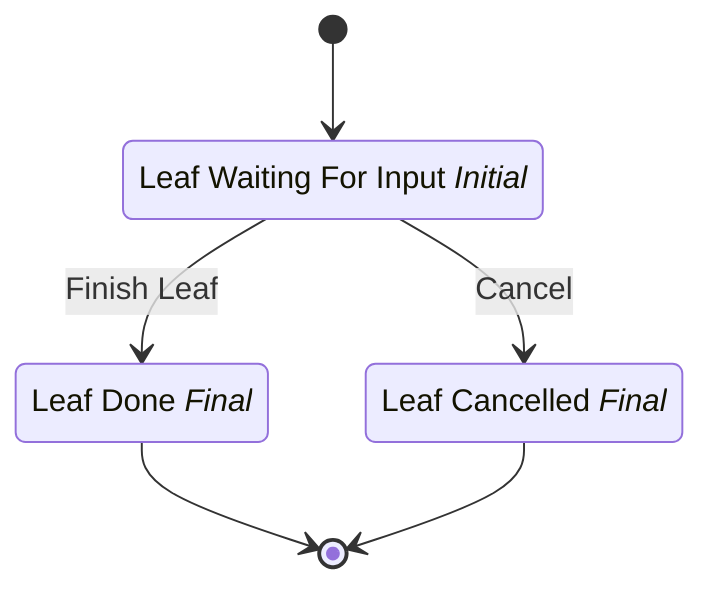

# Chain Busy Leaf

## Metadata

| Property | Value |
| --- | --- |
| Key | `chain-busy-leaf` |
| Domain | `core` |
| Flow | `sys-flows` |
| Version | 1.0.0 |
| Flow Version | 1.0.0 |
| Type | SubFlow |
| Tags | `integration-test`, `chain-busy`, `subflow` |

## State Lifecycle

## Feature Matrix

| Feature | Status |
| --- | --- |
| Cancel Transition | Yes |
| Exit Transition | - |
| Update Data Transition | - |
| Master Schema | - |
| Functions | - |
| Extensions | - |
| Timeout | - |
| Error Boundary | - |
| Shared Transitions | - |
| Query Roles | - |

## Start Transition

**Transition:** Start Chain Busy Leaf (`start-chain-busy-leaf`)

Target: `leaf-waiting` | Trigger: Manual | Version Strategy: Major

## States

### Leaf Waiting For Input (`leaf-waiting`)

**Type:** Initial

#### Transitions

**Transition:** Finish Leaf (`finish-leaf`)

Source: `leaf-waiting` | Target: `leaf-done` | Trigger: Manual | Version Strategy: Minor

---

### Leaf Done (`leaf-done`)

**Type:** Final / Success

### Leaf Cancelled (`leaf-cancelled`)

**Type:** Final / Terminated

## Cancel Transition

**Transition:** Cancel Chain Busy Leaf (`cancel-chain-busy-leaf`)

Target: `leaf-cancelled` | Trigger: Manual | Version Strategy: Major

---
*Generated by vNext Forge*