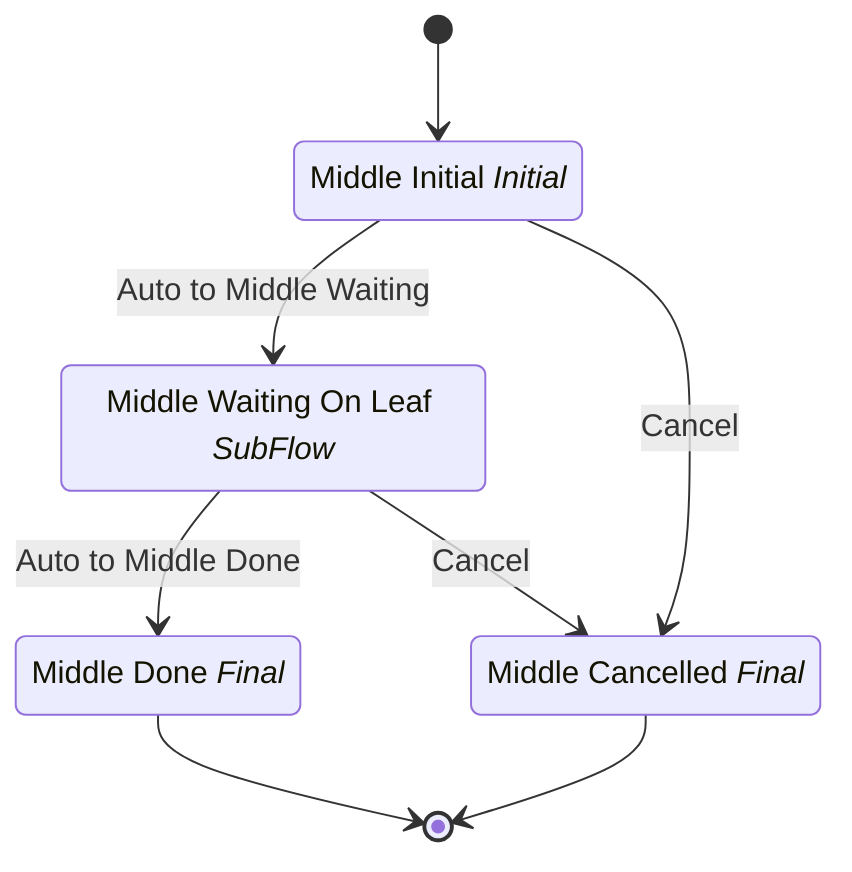

# Chain Busy Middle

## Metadata

| Property | Value |
| --- | --- |
| Key | `chain-busy-middle` |
| Domain | `core` |
| Flow | `sys-flows` |
| Version | 1.0.0 |
| Flow Version | 1.0.0 |
| Type | SubFlow |
| Tags | `integration-test`, `chain-busy`, `subflow` |

## State Lifecycle

## Feature Matrix

| Feature | Status |
| --- | --- |
| Cancel Transition | Yes |
| Exit Transition | - |
| Update Data Transition | - |
| Master Schema | - |
| Functions | - |
| Extensions | - |
| Timeout | - |
| Error Boundary | - |
| Shared Transitions | - |
| Query Roles | - |

## Dependency Tree

### Subflows

| Key | Domain | Version | Cross-domain | Source |
| --- | --- | --- | --- | --- |
| `chain-busy-leaf` | core | 1.0.0 | - | states[middle-waiting].subFlow |

## Start Transition

**Transition:** Start Chain Busy Middle (`start-chain-busy-middle`)

Target: `middle-initial` | Trigger: Manual | Version Strategy: Major

## States

### Middle Initial (`middle-initial`)

**Type:** Initial

#### Transitions

**Transition:** Auto to Middle Waiting (`auto-middle-to-waiting`)

Source: `middle-initial` | Target: `middle-waiting` | Trigger: Automatic | Version Strategy: Minor

---

### Middle Waiting On Leaf (`middle-waiting`)

**Type:** SubFlow

> **SubFlow Reference (SubFlow)**
>
> Process: `chain-busy-leaf`

#### Transitions

**Transition:** Auto to Middle Done (`auto-middle-to-done`)

Source: `middle-waiting` | Target: `middle-done` | Trigger: Automatic | Version Strategy: Minor

---

### Middle Done (`middle-done`)

**Type:** Final / Success

### Middle Cancelled (`middle-cancelled`)

**Type:** Final / Terminated

## Cancel Transition

**Transition:** Cancel Chain Busy Middle (`cancel-chain-busy-middle`)

Target: `middle-cancelled` | Trigger: Manual | Version Strategy: Major

---
*Generated by vNext Forge*