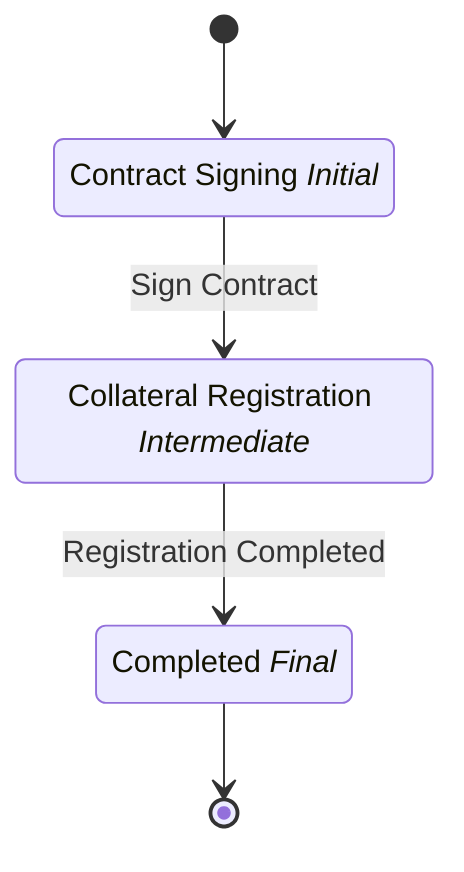

# Collateral Establishment

## Metadata

| Property | Value |
| --- | --- |
| Key | `collateral-establishment` |
| Domain | `core` |
| Flow | `sys-flows` |
| Version | 1.0.0 |
| Flow Version | 1.0.0 |
| Type | SubFlow |
| Tags | `collateral`, `subflow`, `teminat` |

## State Lifecycle

## Feature Matrix

| Feature | Status |
| --- | --- |
| Cancel Transition | - |
| Exit Transition | - |
| Update Data Transition | - |
| Master Schema | - |
| Functions | - |
| Extensions | - |
| Timeout | - |
| Error Boundary | - |
| Shared Transitions | - |
| Query Roles | - |

## Dependency Tree

### Schemas

| Key | Domain | Version | Cross-domain | Source |
| --- | --- | --- | --- | --- |
| `collateral-detail` | core | 1.0.0 | - | states[contract-signing].transitions[sign-contract].schema |

## Start Transition

**Transition:** Start Collateral (`start-collateral`)

Target: `contract-signing` | Trigger: Manual | Version Strategy: Minor

## States

### Contract Signing (`contract-signing`)

**Type:** Initial

#### Transitions

**Transition:** Sign Contract (`sign-contract`)

Source: `contract-signing` | Target: `collateral-registration` | Trigger: Manual | Version Strategy: Minor | Schema: `collateral-detail`

---

### Collateral Registration (`collateral-registration`)

**Type:** Intermediate

#### Transitions

**Transition:** Registration Completed (`registration-completed`)

Source: `collateral-registration` | Target: `completed` | Trigger: Automatic | Version Strategy: Minor

---

### Completed (`completed`)

**Type:** Final / Success

---
*Generated by vNext Forge*