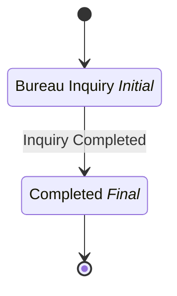

# Credit Bureau Inquiry

## Metadata

| Property | Value |
| --- | --- |
| Key | `credit-bureau-inquiry` |
| Domain | `core` |
| Flow | `sys-flows` |
| Version | 1.0.0 |
| Flow Version | 1.0.0 |
| Type | SubFlow |
| Tags | `credit-bureau`, `subflow`, `kkb`, `findeks` |

## State Lifecycle

## Feature Matrix

| Feature | Status |
| --- | --- |
| Cancel Transition | - |
| Exit Transition | - |
| Update Data Transition | - |
| Master Schema | - |
| Functions | - |
| Extensions | - |
| Timeout | - |
| Error Boundary | - |
| Shared Transitions | - |
| Query Roles | - |

## Dependency Tree

### Tasks

| Key | Domain | Version | Cross-domain | Source |
| --- | --- | --- | --- | --- |
| `inquire-kkb` | core | 1.0.0 | - | states[inquiry].onEntries[0] |
| `inquire-findeks` | core | 1.0.0 | - | states[inquiry].onEntries[1] |

## Start Transition

**Transition:** Start Inquiry (`start-inquiry`)

Target: `inquiry` | Trigger: Manual | Version Strategy: Minor

## States

### Bureau Inquiry (`inquiry`)

**Type:** Initial

**On Entry Tasks:**

| Order | Task | Description | Error Boundary |
| --- | --- | --- | --- |
| 1 | `inquire-kkb` | - | - |
| 2 | `inquire-findeks` | - | - |

#### Transitions

**Transition:** Inquiry Completed (`inquiry-completed`)

Source: `inquiry` | Target: `completed` | Trigger: Automatic | Version Strategy: Minor

---

### Completed (`completed`)

**Type:** Final / Success

---
*Generated by vNext Forge*