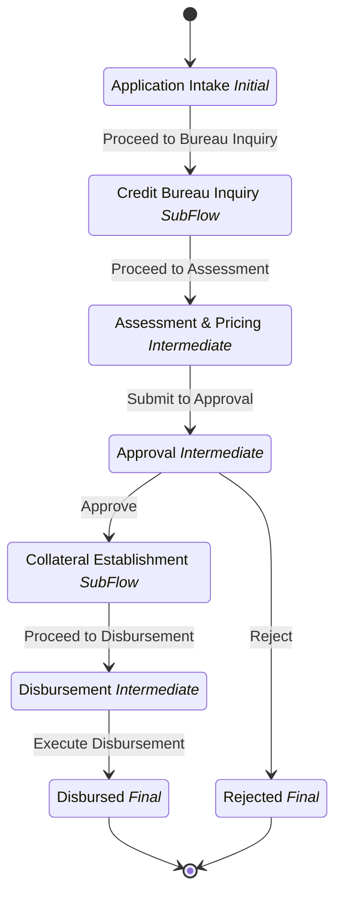

# Loan Disbursement

## Metadata

| Property | Value |
| --- | --- |
| Key | `loan-disbursement` |
| Domain | `core` |
| Flow | `sys-flows` |
| Version | 1.0.0 |
| Flow Version | 1.0.0 |
| Type | Flow |
| Tags | `loan`, `disbursement`, `kredi-kullandirma` |

## State Lifecycle

## Feature Matrix

| Feature | Status |
| --- | --- |
| Cancel Transition | - |
| Exit Transition | - |
| Update Data Transition | - |
| Master Schema | - |
| Functions | Yes |
| Extensions | Yes |
| Timeout | - |
| Error Boundary | - |
| Shared Transitions | - |
| Query Roles | - |

## Dependency Tree

### Tasks

| Key | Domain | Version | Cross-domain | Source |
| --- | --- | --- | --- | --- |
| `validate-application` | core | 1.0.0 | - | states[application-intake].transitions[submit-application].onExecutionTasks[0] |
| `score-and-limit` | core | 1.0.0 | - | states[assessment-pricing].transitions[submit-assessment].onExecutionTasks[0] |
| `price-loan` | core | 1.0.0 | - | states[assessment-pricing].transitions[submit-assessment].onExecutionTasks[1] |
| `compute-required-approver` | core | 1.0.0 | - | states[approval].onEntries[0] |
| `release-block` | core | 1.0.0 | - | states[disbursement].transitions[execute-disbursement].onExecutionTasks[0] |
| `transfer-to-account` | core | 1.0.0 | - | states[disbursement].transitions[execute-disbursement].onExecutionTasks[1] |

### Views

| Key | Domain | Version | Cross-domain | Source |
| --- | --- | --- | --- | --- |
| `application-intake-form` | core | 1.0.0 | - | states[application-intake].view |
| `assessment-pricing-form` | core | 1.0.0 | - | states[assessment-pricing].view |
| `approval-decision-form` | core | 1.0.0 | - | states[approval].view |
| `disbursement-summary` | core | 1.0.0 | - | states[disbursement].view |
| `disbursed-result` | core | 1.0.0 | - | states[disbursed].view |
| `rejected-result` | core | 1.0.0 | - | states[rejected].view |

### Subflows

| Key | Domain | Version | Cross-domain | Source |
| --- | --- | --- | --- | --- |
| `credit-bureau-inquiry` | core | 1.0.0 | - | states[credit-bureau-inquiry].subFlow |
| `collateral-establishment` | core | 1.0.0 | - | states[collateral-establishment].subFlow |

### Functions

| Key | Domain | Version | Cross-domain | Source |
| --- | --- | --- | --- | --- |
| `loan-product-lov` | core | 1.0.0 | - | attributes.functions |

### Extensions

| Key | Domain | Version | Cross-domain | Source |
| --- | --- | --- | --- | --- |
| `customer-profile-enrichment` | core | 1.0.0 | - | attributes.extensions |

### Schemas

| Key | Domain | Version | Cross-domain | Source |
| --- | --- | --- | --- | --- |
| `loan-application` | core | 1.0.0 | - | states[application-intake].transitions[submit-application].schema |
| `loan-assessment` | core | 1.0.0 | - | states[assessment-pricing].transitions[submit-assessment].schema |
| `loan-approval-decision` | core | 1.0.0 | - | states[approval].transitions[approve].schema |
| `loan-rejection` | core | 1.0.0 | - | states[approval].transitions[reject].schema |

## Start Transition

**Transition:** Submit Application (`start-application`)

Target: `application-intake` | Trigger: Manual | Version Strategy: Minor

## States

### Application Intake (`application-intake`)

**Type:** Initial

**View:** `application-intake-form`

#### Transitions

**Transition:** Proceed to Bureau Inquiry (`submit-application`)

Source: `application-intake` | Target: `credit-bureau-inquiry` | Trigger: Manual | Version Strategy: Minor | Schema: `loan-application`

**Tasks:**

| Order | Task | Description | Error Boundary |
| --- | --- | --- | --- |
| 1 | `validate-application` | - | - |

---

### Credit Bureau Inquiry (`credit-bureau-inquiry`)

**Type:** SubFlow

> **SubFlow Reference (SubFlow)**
>
> Process: `credit-bureau-inquiry`

#### Transitions

**Transition:** Proceed to Assessment (`bureau-completed`)

Source: `credit-bureau-inquiry` | Target: `assessment-pricing` | Trigger: Automatic | Version Strategy: Minor

---

### Assessment & Pricing (`assessment-pricing`)

**Type:** Intermediate

**View:** `assessment-pricing-form`

#### Transitions

**Transition:** Submit to Approval (`submit-assessment`)

Source: `assessment-pricing` | Target: `approval` | Trigger: Manual | Version Strategy: Minor | Schema: `loan-assessment`

| Role | Grant |
| --- | --- |
| `core.kredi-tahsis` | allow |

**Tasks:**

| Order | Task | Description | Error Boundary |
| --- | --- | --- | --- |
| 1 | `score-and-limit` | - | - |
| 2 | `price-loan` | - | - |

---

**Query Roles:**

| Role | Grant |
| --- | --- |
| `core.kredi-tahsis` | allow |

### Approval (`approval`)

**Type:** Intermediate

**View:** `approval-decision-form`

**On Entry Tasks:**

| Order | Task | Description | Error Boundary |
| --- | --- | --- | --- |
| 1 | `compute-required-approver` | - | - |

#### Transitions

**Transition:** Approve (`approve`)

Source: `approval` | Target: `collateral-establishment` | Trigger: Manual | Version Strategy: Minor | Schema: `loan-approval-decision`

| Role | Grant |
| --- | --- |
| `$.data.approval.requiredApproverRole` | allow |

---

**Transition:** Reject (`reject`)

Source: `approval` | Target: `rejected` | Trigger: Manual | Version Strategy: Minor | Schema: `loan-rejection`

| Role | Grant |
| --- | --- |
| `$.data.approval.requiredApproverRole` | allow |

---

**Query Roles:**

| Role | Grant |
| --- | --- |
| `$.data.approval.requiredApproverRole` | allow |

### Collateral Establishment (`collateral-establishment`)

**Type:** SubFlow

> **SubFlow Reference (SubFlow)**
>
> Process: `collateral-establishment`

#### Transitions

**Transition:** Proceed to Disbursement (`collateral-completed`)

Source: `collateral-establishment` | Target: `disbursement` | Trigger: Automatic | Version Strategy: Minor

---

**Query Roles:**

| Role | Grant |
| --- | --- |
| `core.operasyon` | allow |

### Disbursement (`disbursement`)

**Type:** Intermediate

**View:** `disbursement-summary`

#### Transitions

**Transition:** Execute Disbursement (`execute-disbursement`)

Source: `disbursement` | Target: `disbursed` | Trigger: Automatic | Version Strategy: Minor

**Tasks:**

| Order | Task | Description | Error Boundary |
| --- | --- | --- | --- |
| 1 | `release-block` | - | - |
| 2 | `transfer-to-account` | - | - |

---

**Query Roles:**

| Role | Grant |
| --- | --- |
| `core.operasyon` | allow |

### Disbursed (`disbursed`)

**Type:** Final / Success

**View:** `disbursed-result`

### Rejected (`rejected`)

**Type:** Final / Error

**View:** `rejected-result`

---
*Generated by vNext Forge*