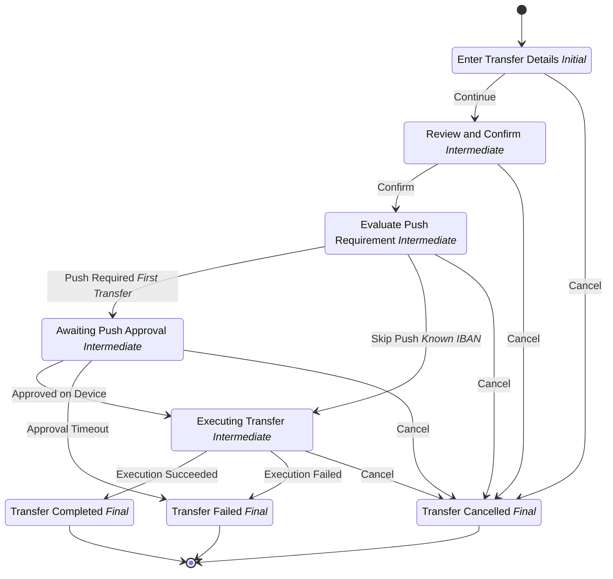

# Para Transferi

## Metadata

| Property | Value |
| --- | --- |
| Key | `money-transfer` |
| Domain | `core` |
| Flow | `sys-flows` |
| Version | 1.0.0 |
| Flow Version | 1.0.0 |
| Type | Flow |
| Tags | `money-transfer`, `payments`, `flow` |

## State Lifecycle

## Feature Matrix

| Feature | Status |
| --- | --- |
| Cancel Transition | Yes |
| Exit Transition | - |
| Update Data Transition | - |
| Master Schema | - |
| Functions | Yes |
| Extensions | - |
| Timeout | - |
| Error Boundary | Yes |
| Shared Transitions | - |
| Query Roles | - |

## Dependency Tree

### Tasks

| Key | Domain | Version | Cross-domain | Source |
| --- | --- | --- | --- | --- |
| `get-iban-history` | core | 1.0.0 | - | states[review-and-confirm].transitions[confirm].onExecutionTasks[0] |
| `execute-transfer` | core | 1.0.0 | - | states[executing-transfer].onEntries[0] |

### Views

| Key | Domain | Version | Cross-domain | Source |
| --- | --- | --- | --- | --- |
| `money-transfer-input-view` | core | 1.0.0 | - | states[enter-transfer-details].view |
| `money-transfer-summary-view` | core | 1.0.0 | - | states[review-and-confirm].view |
| `money-transfer-awaiting-push-view` | core | 1.0.0 | - | states[awaiting-push-approval].view |
| `money-transfer-completed-view` | core | 1.0.0 | - | states[transfer-completed].view |
| `money-transfer-failed-view` | core | 1.0.0 | - | states[transfer-failed].view |
| `money-transfer-cancelled-view` | core | 1.0.0 | - | states[transfer-cancelled].view |

### Functions

| Key | Domain | Version | Cross-domain | Source |
| --- | --- | --- | --- | --- |
| `get-source-accounts` | core | 1.0.0 | - | attributes.functions |
| `get-favorite-beneficiaries` | core | 1.0.0 | - | attributes.functions |

### Schemas

| Key | Domain | Version | Cross-domain | Source |
| --- | --- | --- | --- | --- |
| `money-transfer-input` | core | 1.0.0 | - | states[enter-transfer-details].transitions[submit-details].schema |

## Start Transition

**Transition:** Transferi Başlat (`start`)

Target: `enter-transfer-details` | Trigger: Manual | Version Strategy: Minor

## States

### Transfer Bilgileri (`enter-transfer-details`)

**Type:** Initial

**View:** `money-transfer-input-view`

#### Transitions

**Transition:** Devam Et (`submit-details`)

Source: `enter-transfer-details` | Target: `review-and-confirm` | Trigger: Manual | Version Strategy: Minor | Schema: `money-transfer-input`

---

### Gözden Geçir ve Onayla (`review-and-confirm`)

**Type:** Intermediate

**View:** `money-transfer-summary-view`

#### Transitions

**Transition:** Onayla (`confirm`)

Source: `review-and-confirm` | Target: `evaluate-push-requirement` | Trigger: Manual | Version Strategy: Minor

**Tasks:**

| Order | Task | Description | Error Boundary |
| --- | --- | --- | --- |
| 1 | `get-iban-history` | - | - |

---

### Push Gereksinimi Değerlendiriliyor (`evaluate-push-requirement`)

**Type:** Intermediate

#### Transitions

**Transition:** Push Gerekli (İlk Transfer) (`require-push`)

Source: `evaluate-push-requirement` | Target: `awaiting-push-approval` | Trigger: Automatic | Version Strategy: Minor

---

**Transition:** Push Atla (Bilinen IBAN) (`skip-push`)

Source: `evaluate-push-requirement` | Target: `executing-transfer` | Trigger: Automatic | Version Strategy: Minor

---

### Push Onayı Bekleniyor (`awaiting-push-approval`)

**Type:** Intermediate

**View:** `money-transfer-awaiting-push-view`

#### Transitions

**Transition:** Cihazdan Onaylandı (`approve-push`)

Source: `awaiting-push-approval` | Target: `executing-transfer` | Trigger: Manual | Version Strategy: Minor

---

**Transition:** Onay Zaman Aşımı (`push-timeout`)

Source: `awaiting-push-approval` | Target: `transfer-failed` | Trigger: Scheduled | Version Strategy: Minor

---

### Transfer Gerçekleştiriliyor (`executing-transfer`)

**Type:** Intermediate

**On Entry Tasks:**

| Order | Task | Description | Error Boundary |
| --- | --- | --- | --- |
| 1 | `execute-transfer` | - | - |

#### Transitions

**Transition:** Transfer Başarılı (`execution-succeeded`)

Source: `executing-transfer` | Target: `transfer-completed` | Trigger: Automatic | Version Strategy: Minor

---

**Transition:** Transfer Başarısız (`execution-failed`)

Source: `executing-transfer` | Target: `transfer-failed` | Trigger: Automatic | Version Strategy: Minor

---

### Transfer Tamamlandı (`transfer-completed`)

**Type:** Final / Success

**View:** `money-transfer-completed-view`

### Transfer Başarısız (`transfer-failed`)

**Type:** Final / Error

**View:** `money-transfer-failed-view`

### Transfer İptal Edildi (`transfer-cancelled`)

**Type:** Final / Unknown

**View:** `money-transfer-cancelled-view`

## Cancel Transition

**Transition:** Transferi İptal Et (`cancel-transfer`)

Target: `transfer-cancelled` | Trigger: Manual | Version Strategy: Minor

---
*Generated by vNext Forge*