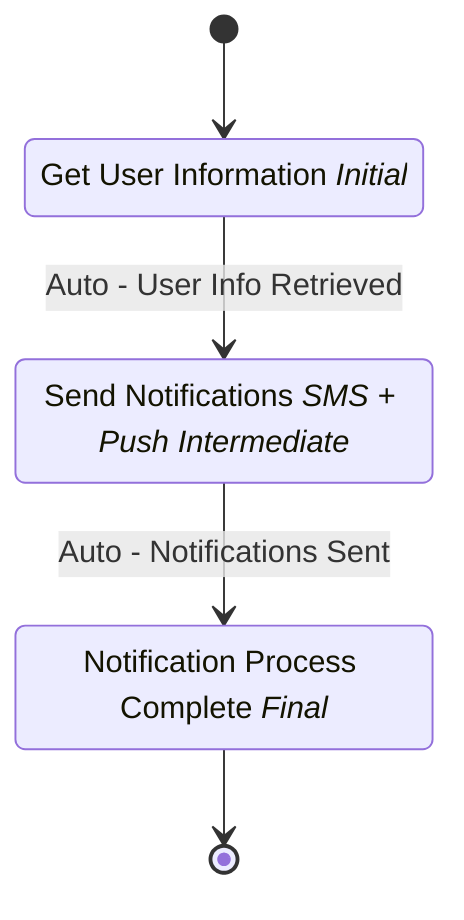

# Payment Notification Subflow

## Metadata

| Property | Value |
| --- | --- |
| Key | `payment-notification-subflow` |
| Domain | `core` |
| Flow | `sys-flows` |
| Version | 1.0.0 |
| Flow Version | 1.0.0 |
| Type | Sub Process |
| Tags | `payments`, `notification`, `sms`, `push`, `subflow` |

## State Lifecycle

## Feature Matrix

| Feature | Status |
| --- | --- |
| Cancel Transition | - |
| Exit Transition | - |
| Update Data Transition | - |
| Master Schema | - |
| Functions | - |
| Extensions | - |
| Timeout | - |
| Error Boundary | - |
| Shared Transitions | - |
| Query Roles | - |

## Dependency Tree

### Tasks

| Key | Domain | Version | Cross-domain | Source |
| --- | --- | --- | --- | --- |
| `get-user-info` | core | 1.0.0 | - | states[get-user-info].onEntries[0] |
| `send-payment-notification-sms` | core | 1.0.0 | - | states[send-notifications].onEntries[0] |
| `send-payment-push-notification` | core | 1.0.0 | - | states[send-notifications].onEntries[1] |

## Start Transition

**Transition:** Start Notification Process (`start-notification`)

Target: `get-user-info` | Trigger: Manual | Version Strategy: Minor

## States

### Get User Information (`get-user-info`)

**Type:** Initial

**On Entry Tasks:**

| Order | Task | Description | Error Boundary |
| --- | --- | --- | --- |
| 1 | `get-user-info` | - | - |

#### Transitions

**Transition:** Auto - User Info Retrieved (`user-info-retrieved`)

Source: `get-user-info` | Target: `send-notifications` | Trigger: Automatic | Version Strategy: Minor

---

### Send Notifications (SMS + Push) (`send-notifications`)

**Type:** Intermediate

**On Entry Tasks:**

| Order | Task | Description | Error Boundary |
| --- | --- | --- | --- |
| 1 | `send-payment-notification-sms` | - | - |
| 2 | `send-payment-push-notification` | - | - |

#### Transitions

**Transition:** Auto - Notifications Sent (`notifications-sent`)

Source: `send-notifications` | Target: `notification-complete` | Trigger: Automatic | Version Strategy: Minor

---

### Notification Process Complete (`notification-complete`)

**Type:** Final / Success

---
*Generated by vNext Forge*