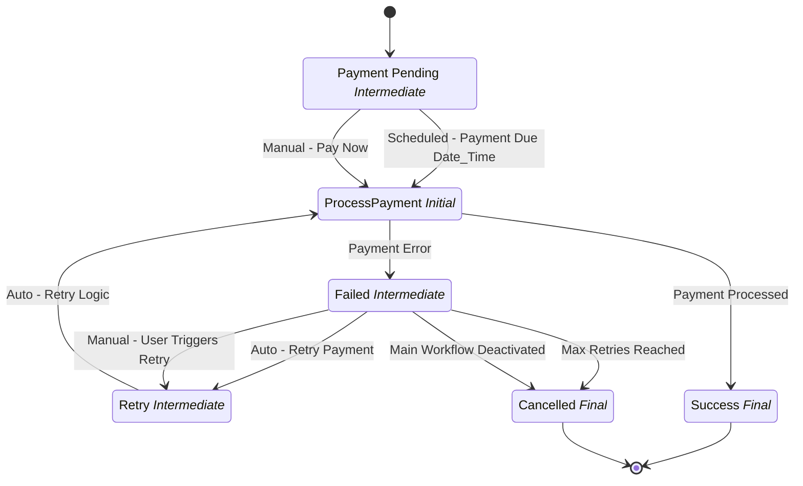

# Payment Processing

## Metadata

| Property | Value |
| --- | --- |
| Key | `payment-process` |
| Domain | `core` |
| Flow | `sys-flows` |
| Version | 1.0.0 |
| Flow Version | 1.0.0 |
| Type | SubFlow |
| Tags | `payments`, `process`, `retry`, `processing`, `transaction` |

## State Lifecycle

## Feature Matrix

| Feature | Status |
| --- | --- |
| Cancel Transition | - |
| Exit Transition | - |
| Update Data Transition | - |
| Master Schema | - |
| Functions | - |
| Extensions | - |
| Timeout | - |
| Error Boundary | - |
| Shared Transitions | - |
| Query Roles | - |

## Dependency Tree

### Tasks

| Key | Domain | Version | Cross-domain | Source |
| --- | --- | --- | --- | --- |
| `process-payment` | core | 1.0.0 | - | states[process-payment].onEntries[0] |
| `increment-retry-counter` | core | 1.0.0 | - | states[payment-retry].onEntries[0] |

## Start Transition

**Transition:** Start Payment Processing (`start-payment-processing`)

Target: `payment-pending` | Trigger: Manual | Version Strategy: Minor

## States

### Payment Pending (`payment-pending`)

**Type:** Intermediate

#### Transitions

**Transition:** Scheduled - Payment Due Date/Time (`scheduled-payment-due`)

Source: `payment-pending` | Target: `process-payment` | Trigger: Scheduled | Version Strategy: Minor

---

**Transition:** Manual - Pay Now (`manual-pay-now`)

Source: `payment-pending` | Target: `process-payment` | Trigger: Manual | Version Strategy: Minor

---

### ProcessPayment (`process-payment`)

**Type:** Initial

**On Entry Tasks:**

| Order | Task | Description | Error Boundary |
| --- | --- | --- | --- |
| 1 | `process-payment` | - | - |

#### Transitions

**Transition:** Payment Processed (`payment-success`)

Source: `process-payment` | Target: `payment-success-state` | Trigger: Automatic | Version Strategy: Minor

---

**Transition:** Payment Error (`payment-error`)

Source: `process-payment` | Target: `payment-failed-state` | Trigger: Automatic | Version Strategy: Minor

---

### Failed (`payment-failed-state`)

**Type:** Intermediate / Error

#### Transitions

**Transition:** Auto - Retry Payment (`auto-retry-payment`)

Source: `payment-failed-state` | Target: `payment-retry` | Trigger: Automatic | Version Strategy: Minor

---

**Transition:** Manual - User Triggers Retry (`manual-user-triggers-retry`)

Source: `payment-failed-state` | Target: `payment-retry` | Trigger: Manual | Version Strategy: Minor

---

**Transition:** Max Retries Reached (`max-retries-reached`)

Source: `payment-failed-state` | Target: `payment-cancelled` | Trigger: Automatic | Version Strategy: Minor

---

**Transition:** Main Workflow Deactivated (`main-workflow-deactivated`)

Source: `payment-failed-state` | Target: `payment-cancelled` | Trigger: Automatic | Version Strategy: Minor

---

### Retry (`payment-retry`)

**Type:** Intermediate

**On Entry Tasks:**

| Order | Task | Description | Error Boundary |
| --- | --- | --- | --- |
| 1 | `increment-retry-counter` | - | - |

#### Transitions

**Transition:** Auto - Retry Logic (`retry-logic`)

Source: `payment-retry` | Target: `process-payment` | Trigger: Automatic | Version Strategy: Minor

---

### Success (`payment-success-state`)

**Type:** Final / Success

### Cancelled (`payment-cancelled`)

**Type:** Final / Terminated

---
*Generated by vNext Forge*