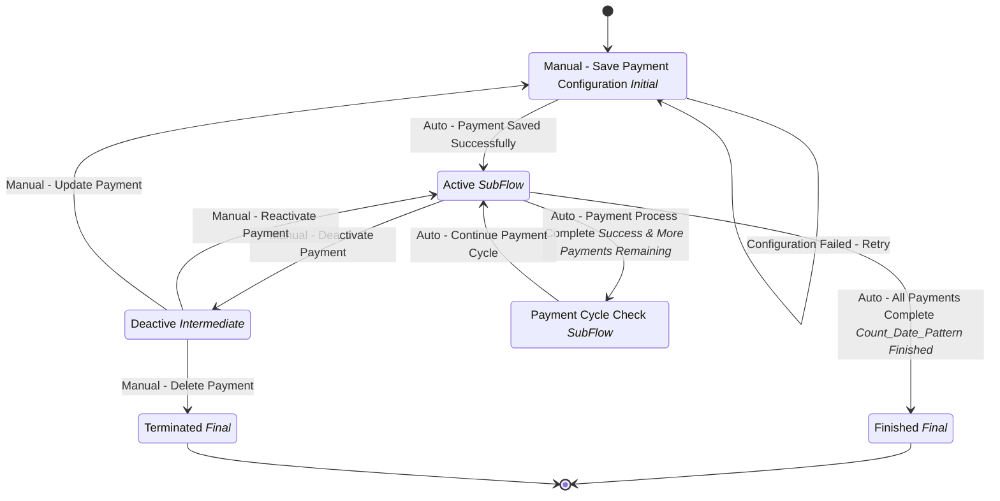

# Scheduled Payments Workflow

## Metadata

| Property | Value |
| --- | --- |
| Key | `scheduled-payments` |
| Domain | `core` |
| Flow | `sys-flows` |
| Version | 1.0.0 |
| Flow Version | 1.0.0 |
| Type | Flow |
| Tags | `payments`, `scheduled`, `recurring`, `financial`, `automation` |

## State Lifecycle

## Feature Matrix

| Feature | Status |
| --- | --- |
| Cancel Transition | - |
| Exit Transition | - |
| Update Data Transition | - |
| Master Schema | - |
| Functions | Yes |
| Extensions | - |
| Timeout | - |
| Error Boundary | - |
| Shared Transitions | - |
| Query Roles | - |

## Dependency Tree

### Tasks

| Key | Domain | Version | Cross-domain | Source |
| --- | --- | --- | --- | --- |
| `save-payment-configuration` | core | 1.0.0 | - | states[payment-configuration].onEntries[0] |
| `activate-payment-schedule` | core | 1.0.0 | - | states[payment-active].onEntries[0] |
| `deactivate-payment-schedule` | core | 1.0.0 | - | states[payment-deactive].onEntries[0] |
| `archive-payment-record` | core | 1.0.0 | - | states[payment-finished].onEntries[0] |

### Subflows

| Key | Domain | Version | Cross-domain | Source |
| --- | --- | --- | --- | --- |
| `payment-process` | core | 1.0.0 | - | states[payment-active].subFlow |
| `payment-notification-subflow` | core | 1.0.0 | - | states[payment-cycle-check].subFlow |

### Functions

| Key | Domain | Version | Cross-domain | Source |
| --- | --- | --- | --- | --- |
| `function-get-user-info` | core | 1.0.0 | - | attributes.functions |

## Start Transition

**Transition:** Start Payment Setup (`start-payment-setup`)

Target: `payment-configuration` | Trigger: Manual | Version Strategy: Minor

## States

### Manual - Save Payment Configuration (`payment-configuration`)

**Type:** Initial

**On Entry Tasks:**

| Order | Task | Description | Error Boundary |
| --- | --- | --- | --- |
| 1 | `save-payment-configuration` | - | - |

#### Transitions

**Transition:** Auto - Payment Saved Successfully (`payment-config-saved`)

Source: `payment-configuration` | Target: `payment-active` | Trigger: Automatic | Version Strategy: Minor

---

**Transition:** Configuration Failed - Retry (`payment-config-failed`)

Source: `payment-configuration` | Target: `payment-configuration` | Trigger: Automatic | Version Strategy: Minor

---

### Active (`payment-active`)

**Type:** SubFlow

> **SubFlow Reference (SubFlow)**
>
> Process: `payment-process`

**On Entry Tasks:**

| Order | Task | Description | Error Boundary |
| --- | --- | --- | --- |
| 1 | `activate-payment-schedule` | - | - |

#### Transitions

**Transition:** Manual - Deactivate Payment (`manual-deactivate-payment`)

Source: `payment-active` | Target: `payment-deactive` | Trigger: Manual | Version Strategy: Minor

---

**Transition:** Auto - Payment Process Complete (Success & More Payments Remaining) (`payment-process-complete`)

Source: `payment-active` | Target: `payment-cycle-check` | Trigger: Automatic | Version Strategy: Minor

---

**Transition:** Auto - All Payments Complete (Count/Date/Pattern Finished) (`payments-all-complete`)

Source: `payment-active` | Target: `payment-finished` | Trigger: Automatic | Version Strategy: Minor

---

### Deactive (`payment-deactive`)

**Type:** Intermediate

**On Entry Tasks:**

| Order | Task | Description | Error Boundary |
| --- | --- | --- | --- |
| 1 | `deactivate-payment-schedule` | - | - |

#### Transitions

**Transition:** Manual - Reactivate Payment (`manual-reactivate-payment`)

Source: `payment-deactive` | Target: `payment-active` | Trigger: Manual | Version Strategy: Minor

---

**Transition:** Manual - Update Payment (`manual-update-payment`)

Source: `payment-deactive` | Target: `payment-configuration` | Trigger: Manual | Version Strategy: Minor

---

**Transition:** Manual - Delete Payment (`manual-delete-payment`)

Source: `payment-deactive` | Target: `payment-terminated` | Trigger: Manual | Version Strategy: Minor

---

### Payment Cycle Check (`payment-cycle-check`)

**Type:** SubFlow

> **SubFlow Reference (Sub Process)**
>
> Process: `payment-notification-subflow`

#### Transitions

**Transition:** Auto - Continue Payment Cycle (`continue-payment-cycle`)

Source: `payment-cycle-check` | Target: `payment-active` | Trigger: Automatic | Version Strategy: Minor

---

### Finished (`payment-finished`)

**Type:** Final / Success

**On Entry Tasks:**

| Order | Task | Description | Error Boundary |
| --- | --- | --- | --- |
| 1 | `archive-payment-record` | - | - |

### Terminated (`payment-terminated`)

**Type:** Final / Terminated

---
*Generated by vNext Forge*