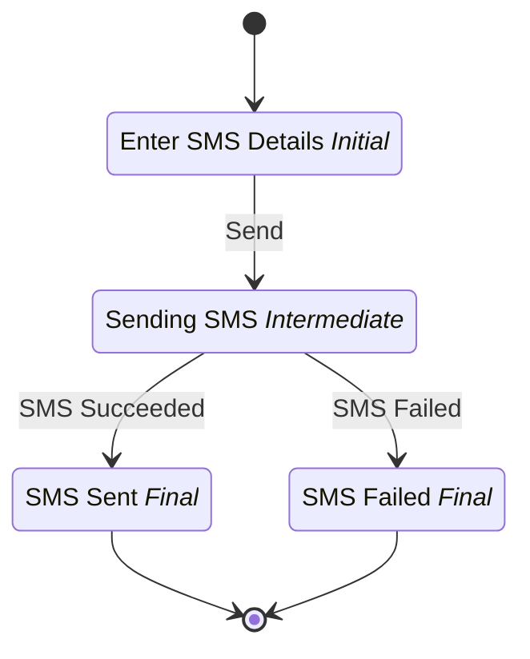

# SOAP Görev Testi

## Metadata

| Property | Value |
| --- | --- |
| Key | `soap-task-test` |
| Domain | `core` |
| Flow | `sys-flows` |
| Version | 1.0.0 |
| Flow Version | 1.0.0 |
| Type | Flow |
| Tags | `soap`, `sms`, `vip-sender`, `integration-test`, `core` |

## State Lifecycle

## Feature Matrix

| Feature | Status |
| --- | --- |
| Cancel Transition | - |
| Exit Transition | - |
| Update Data Transition | - |
| Master Schema | - |
| Functions | - |
| Extensions | - |
| Timeout | - |
| Error Boundary | - |
| Shared Transitions | - |
| Query Roles | - |

## Dependency Tree

### Tasks

| Key | Domain | Version | Cross-domain | Source |
| --- | --- | --- | --- | --- |
| `vip-sender` | core | 1.0.0 | - | states[sending-sms].onEntries[0] |

### Views

| Key | Domain | Version | Cross-domain | Source |
| --- | --- | --- | --- | --- |
| `soap-sms-input-view` | core | 1.0.0 | - | states[enter-sms-details].view |
| `soap-sms-result-view` | core | 1.0.0 | - | states[sms-sent].view |

### Schemas

| Key | Domain | Version | Cross-domain | Source |
| --- | --- | --- | --- | --- |
| `soap-sms-input` | core | 1.0.0 | - | states[enter-sms-details].transitions[submit-sms-details].schema |

## Start Transition

**Transition:** Başlat (`start`)

Target: `enter-sms-details` | Trigger: Manual | Version Strategy: Minor

## States

### SMS Bilgileri (`enter-sms-details`)

**Type:** Initial

**View:** `soap-sms-input-view`

#### Transitions

**Transition:** Gönder (`submit-sms-details`)

Source: `enter-sms-details` | Target: `sending-sms` | Trigger: Manual | Version Strategy: Minor | Schema: `soap-sms-input`

---

### SMS Gönderiliyor (`sending-sms`)

**Type:** Intermediate

**On Entry Tasks:**

| Order | Task | Description | Error Boundary |
| --- | --- | --- | --- |
| 1 | `vip-sender` | - | - |

#### Transitions

**Transition:** SMS Başarılı (`sms-succeeded`)

Source: `sending-sms` | Target: `sms-sent` | Trigger: Automatic | Version Strategy: Minor

---

**Transition:** SMS Başarısız (`sms-failed`)

Source: `sending-sms` | Target: `sms-failed` | Trigger: Automatic | Version Strategy: Minor

---

### SMS Gönderildi (`sms-sent`)

**Type:** Final / Success

**View:** `soap-sms-result-view`

### SMS Başarısız (`sms-failed`)

**Type:** Final / Error

**View:** `soap-sms-result-view`

---
*Generated by vNext Forge*