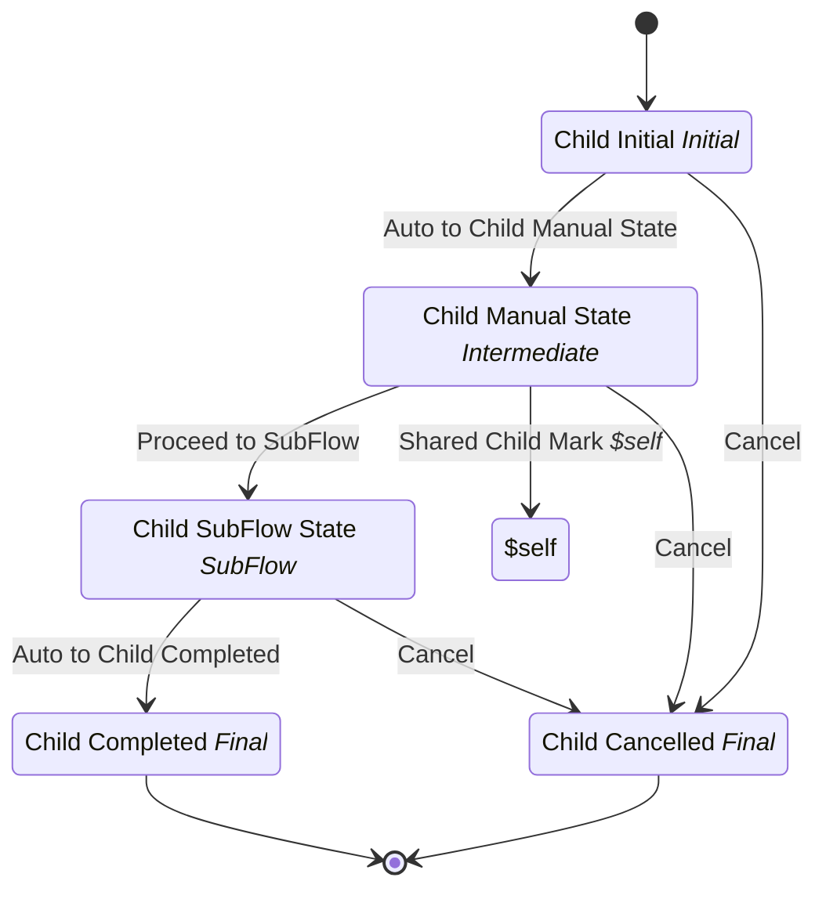

# SubFlow Orchestration Child

## Metadata

| Property | Value |
| --- | --- |
| Key | `subflow-orchestration-child` |
| Domain | `core` |
| Flow | `sys-flows` |
| Version | 1.0.0 |
| Flow Version | 1.0.0 |
| Type | SubFlow |
| Tags | `integration-test`, `subflow-orchestration`, `child`, `subflow`, `shared-transitions` |

## State Lifecycle

## Feature Matrix

| Feature | Status |
| --- | --- |
| Cancel Transition | Yes |
| Exit Transition | - |
| Update Data Transition | Yes |
| Master Schema | - |
| Functions | - |
| Extensions | - |
| Timeout | - |
| Error Boundary | - |
| Shared Transitions | Yes |
| Query Roles | - |

## Dependency Tree

### Tasks

| Key | Domain | Version | Cross-domain | Source |
| --- | --- | --- | --- | --- |
| `subflow-script-task` | core | 1.0.0 | - | states[child-initial].onEntries[0] |

### Subflows

| Key | Domain | Version | Cross-domain | Source |
| --- | --- | --- | --- | --- |
| `subflow-orchestration-grandchild` | core | 1.0.0 | - | states[child-subflow-state].subFlow |

## Start Transition

**Transition:** Start Child (`start-subflow-orchestration-child`)

Target: `child-initial` | Trigger: Manual | Version Strategy: Major

## States

### Child Initial (`child-initial`)

**Type:** Initial

**On Entry Tasks:**

| Order | Task | Description | Error Boundary |
| --- | --- | --- | --- |
| 1 | `subflow-script-task` | - | - |

#### Transitions

**Transition:** Auto to Child Manual State (`auto-child-to-manual`)

Source: `child-initial` | Target: `child-manual-state` | Trigger: Automatic | Version Strategy: Minor

---

### Child Manual State (`child-manual-state`)

**Type:** Intermediate

#### Transitions

**Transition:** Proceed to SubFlow (`proceed-to-subflow`)

Source: `child-manual-state` | Target: `child-subflow-state` | Trigger: Manual | Version Strategy: Minor

---

### Child SubFlow State (`child-subflow-state`)

**Type:** SubFlow

> **SubFlow Reference (SubFlow)**
>
> Process: `subflow-orchestration-grandchild`

#### Transitions

**Transition:** Auto to Child Completed (`auto-child-to-completed`)

Source: `child-subflow-state` | Target: `child-completed` | Trigger: Automatic | Version Strategy: Minor

---

### Child Completed (`child-completed`)

**Type:** Final / Success

### Child Cancelled (`child-cancelled`)

**Type:** Final / Terminated

## Shared Transitions

### Shared Child Mark ($self) (`shared-child-mark`)

**Available In:** `child-manual-state`

**Transition:** Shared Child Mark ($self) (`shared-child-mark`)

Target: `$self` | Trigger: Manual | Version Strategy: Minor

**Tasks:**

| Order | Task | Description | Error Boundary |
| --- | --- | --- | --- |
| 1 | `subflow-script-task` | - | - |

## Cancel Transition

**Transition:** Cancel Child (`cancel-child`)

Target: `child-cancelled` | Trigger: Manual | Version Strategy: Major

## Update Data Transition

**Transition:** Update Parent Data from Child (`update-parent-data`)

Target: `$self` | Trigger: Manual | Version Strategy: Minor

**Tasks:**

| Order | Task | Description | Error Boundary |
| --- | --- | --- | --- |
| 1 | `subflow-script-task` | - | - |

---
*Generated by vNext Forge*