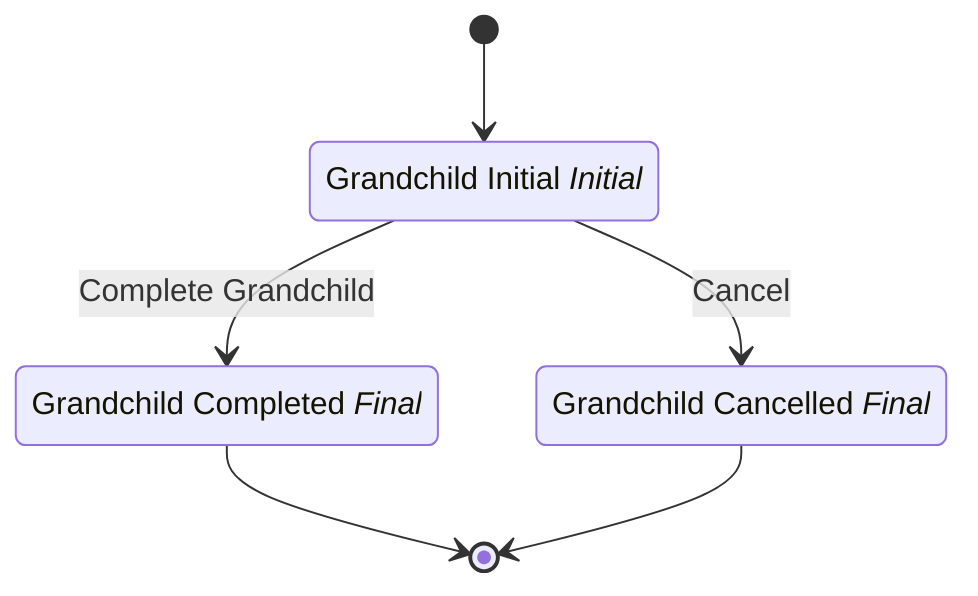

# SubFlow Orchestration Grandchild

## Metadata

| Property | Value |
| --- | --- |
| Key | `subflow-orchestration-grandchild` |
| Domain | `core` |
| Flow | `sys-flows` |
| Version | 1.0.0 |
| Flow Version | 1.0.0 |
| Type | SubFlow |
| Tags | `integration-test`, `subflow-orchestration`, `grandchild`, `subflow` |

## State Lifecycle

## Feature Matrix

| Feature | Status |
| --- | --- |
| Cancel Transition | Yes |
| Exit Transition | - |
| Update Data Transition | - |
| Master Schema | - |
| Functions | - |
| Extensions | - |
| Timeout | - |
| Error Boundary | - |
| Shared Transitions | - |
| Query Roles | - |

## Dependency Tree

### Tasks

| Key | Domain | Version | Cross-domain | Source |
| --- | --- | --- | --- | --- |
| `subflow-script-task` | core | 1.0.0 | - | states[grandchild-initial].onEntries[0] |

## Start Transition

**Transition:** Start Grandchild (`start-subflow-orchestration-grandchild`)

Target: `grandchild-initial` | Trigger: Manual | Version Strategy: Major

## States

### Grandchild Initial (`grandchild-initial`)

**Type:** Initial

**On Entry Tasks:**

| Order | Task | Description | Error Boundary |
| --- | --- | --- | --- |
| 1 | `subflow-script-task` | - | - |

#### Transitions

**Transition:** Complete Grandchild (`complete-grandchild`)

Source: `grandchild-initial` | Target: `grandchild-completed` | Trigger: Manual | Version Strategy: Minor

---

### Grandchild Completed (`grandchild-completed`)

**Type:** Final / Success

**On Entry Tasks:**

| Order | Task | Description | Error Boundary |
| --- | --- | --- | --- |
| 1 | `subflow-script-task` | - | - |

### Grandchild Cancelled (`grandchild-cancelled`)

**Type:** Final / Terminated

## Cancel Transition

**Transition:** Cancel Grandchild (`cancel-grandchild`)

Target: `grandchild-cancelled` | Trigger: Manual | Version Strategy: Major

---
*Generated by vNext Forge*