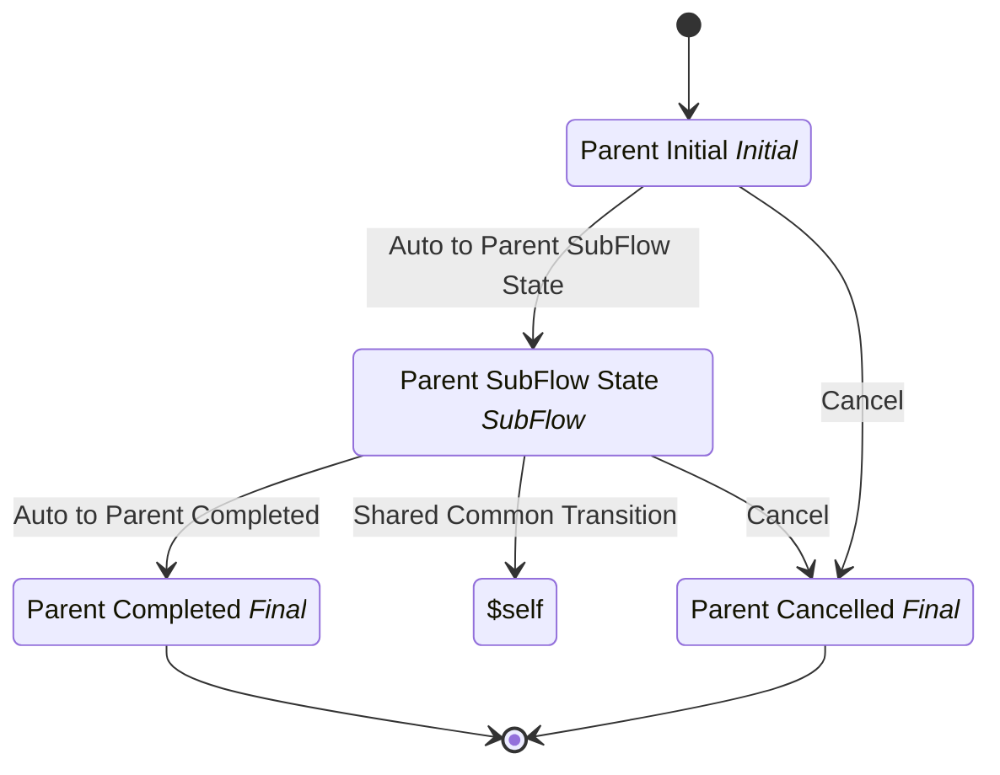

# SubFlow Orchestration Parent

## Metadata

| Property | Value |
| --- | --- |
| Key | `subflow-orchestration-parent` |
| Domain | `core` |
| Flow | `sys-flows` |
| Version | 1.0.0 |
| Flow Version | 1.0.0 |
| Type | Flow |
| Tags | `integration-test`, `subflow-orchestration`, `parent`, `shared-transitions`, `cancel` |

## State Lifecycle

## Feature Matrix

| Feature | Status |
| --- | --- |
| Cancel Transition | Yes |
| Exit Transition | - |
| Update Data Transition | - |
| Master Schema | - |
| Functions | - |
| Extensions | - |
| Timeout | - |
| Error Boundary | - |
| Shared Transitions | Yes |
| Query Roles | - |

## Dependency Tree

### Tasks

| Key | Domain | Version | Cross-domain | Source |
| --- | --- | --- | --- | --- |
| `subflow-script-task` | core | 1.0.0 | - | startTransition.onExecutionTasks[0] |

### Subflows

| Key | Domain | Version | Cross-domain | Source |
| --- | --- | --- | --- | --- |
| `subflow-orchestration-child` | core | 1.0.0 | - | states[parent-subflow-state].subFlow |

## Start Transition

**Transition:** Start Parent Orchestration (`start-subflow-orchestration-parent`)

Target: `parent-initial` | Trigger: Manual | Version Strategy: Major

**Tasks:**

| Order | Task | Description | Error Boundary |
| --- | --- | --- | --- |
| 1 | `subflow-script-task` | - | - |

## States

### Parent Initial (`parent-initial`)

**Type:** Initial

#### Transitions

**Transition:** Auto to Parent SubFlow State (`auto-parent-to-subflow`)

Source: `parent-initial` | Target: `parent-subflow-state` | Trigger: Automatic | Version Strategy: Minor

---

### Parent SubFlow State (`parent-subflow-state`)

**Type:** SubFlow

> **SubFlow Reference (SubFlow)**
>
> Process: `subflow-orchestration-child`

#### Transitions

**Transition:** Auto to Parent Completed (`auto-parent-to-completed`)

Source: `parent-subflow-state` | Target: `parent-completed` | Trigger: Automatic | Version Strategy: Minor

---

### Parent Completed (`parent-completed`)

**Type:** Final / Success

### Parent Cancelled (`parent-cancelled`)

**Type:** Final / Terminated

## Shared Transitions

### Shared Common Transition (`shared-common-transition`)

**Available In:** `parent-subflow-state`

**Transition:** Shared Common Transition (`shared-common-transition`)

Target: `$self` | Trigger: Manual | Version Strategy: Minor

**Tasks:**

| Order | Task | Description | Error Boundary |
| --- | --- | --- | --- |
| 1 | `subflow-script-task` | - | - |

## Cancel Transition

**Transition:** Cancel Parent (`cancel-parent`)

Target: `parent-cancelled` | Trigger: Manual | Version Strategy: Major

---
*Generated by vNext Forge*